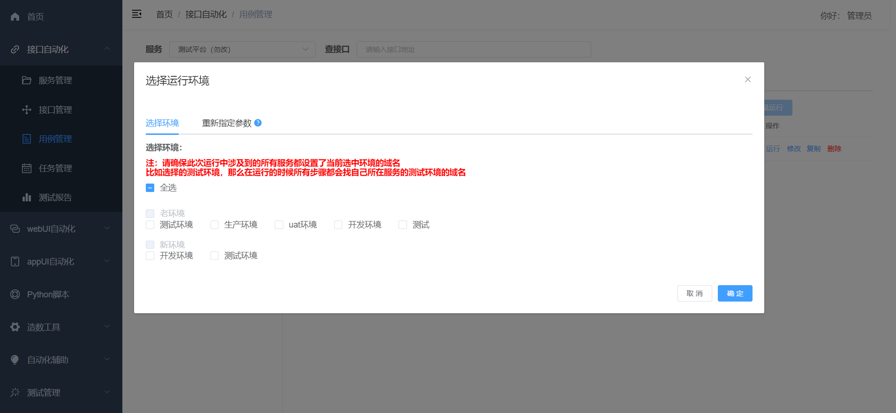
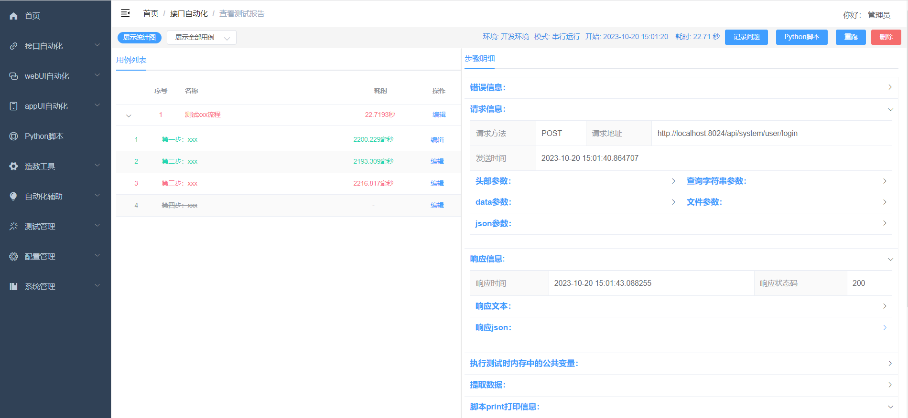

# 基于python-flask3.x + SQLAlchemy2.x生态开发的rest风格的测试平台后端

### 截止2023-11-27，有历史数据的用户，执行以下两个步骤
	1、执行init_sql.py里面的sql语句初始化数据库
	2、执行数据库迁移那3条命令

### 线上预览：http://139.196.100.202/#/login  账号：admin、密码：123456，请不要修改密码

### 前端传送门：https://github.com/zhongyehai/test-platform-front

### 系统操作手册：[gitee](https://gitee.com/Xiang-Qian-Zou/api-test-api/blob/master/%E6%93%8D%E4%BD%9C%E6%89%8B%E5%86%8C.md) ，[github](https://github.com/zhongyehai/api-test-api/blob/main/%E6%93%8D%E4%BD%9C%E6%89%8B%E5%86%8C.md)

## Python版本：python => 3.11+

### 1.安装依赖包：sudo pip install -i https://pypi.tuna.tsinghua.edu.cn/simple -r requirements.txt

### 2.创建MySQL数据库
    MySQL版本：8+
    数据库名自己取，编码选择utf8mb4，对应config.yaml下db配置为当前数据库信息即可
    查看最大连接数 show variables like 'max_connections';
    设置最大连接数 set global max_connections=16384;

### 3.初始化数据库表结构（项目根目录下依次执行）：
        3.1、指定app
            在 Windows 命令提示符中：set FLASK_APP=main.py
            在 Windows PowerShell 中：$env:FLASK_APP="main.py"
            在 Linux 或 macOS 的终端中：export FLASK_APP=main.py
        3.2、执行数据库迁移
            flask db init
            flask db migrate
            flask db upgrade
        如果上面3条命令报错，试试
            python -m flask db init
            python -m flask db migrate
            python -m flask db upgrade

### 4.初始化权限、角色、管理员一起一些初始化配置（项目根目录下执行，账号：admin，密码：123456）
    sudo python db_migration.py

### 5、若要进行UI自动化：

    5.1.安装浏览器

    5.2.准备浏览器驱动
        5.2.1、根据要用来做自动化的浏览器的类型下载对应版本的驱动，详见：https://www.selenium.dev/documentation/zh-cn/webdriver/driver_requirements/
        5.2.2、把下载的驱动放到项目外的 browser_drivers 路径下，项目启动时若没有则会自动创建，若项目未启动过，则需手动创建

    5.3.给驱动加权限：chmod +x chromedriver
    5.4.目前仅支持chrome浏览器，如果需要支持更多浏览器，参照 \utils\client\test_runner\webdriver_action.GetWebDriver 自己扩展

### 6.生产环境下的一些配置:

    1.把main端口改为8024启动
    2.把job端口改为8025启动
    3.准备好前端包，并在nginx.location / 下指定前端包的路径
    4.直接把项目下的nginx.conf文件替换nginx下的nginx.conf文件
    5.nginx -s reload 重启nginx

### 7.启动测试平台

    本地开发: 
        运行测试平台主服务              main.py
        运行定时任务/运行任务调度服务     job.py

    生产环境:
        项目根目录
        1、给shell加执行权限: chmod 755 start.sh kill.sh
        2、启动项目，执行启动shell: ./start.sh
        3、关闭项目，执行启动shell: ./kill.sh

### 修改依赖后创建依赖：sudo pip freeze > requirements.txt

### 创作不易，麻烦给个星哦

### QQ交流群：249728408

### 博客地址：https://www.cnblogs.com/zhongyehai/

## 项目关键截图

#### 选择运行环境

#### 测试执行进度

#### 测试报告

